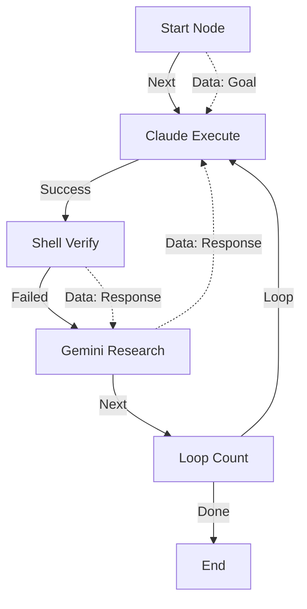

# WheelHouse: Comprehensive User & Developer Guide

Welcome to the comprehensive guide for **WheelHouse**, the desktop cockpit for AI-assisted coding. This document provides step-by-step walkthroughs, navigation breadcrumbs, and deep-dive technical configurations to help you get the most out of WheelHouse's double-agent loop and visual scripting engine.

---

## 1. Quick Start Walkthrough

Follow this step-by-step pathway to get WheelHouse up and running with a fully local vector database for codebase research.

```
Breadcrumbs: Prerequisites ➔ API Keys (.env) ➔ Local RAG Download ➔ Run
```

### Step 1: Install Prerequisites
Ensure you have the following installed on your machine:
* **.NET 8 SDK**: Verify with `dotnet --version` (should return `8.0.x`).
* **Node.js / NPM**: Verify with `npm --version`.
* **Claude Code CLI**: Install the official package globally:
  ```bash
  npm install -g @anthropic-ai/claude-code
  ```
  Ensure you are authenticated by running `claude login`.

### Step 2: Configure Environment (`.env`)
1. Duplicate `.env.example` in the project root and rename it to `.env`.
2. Open `.env` and fill in your keys:
   ```ini
   GEMINI_API_KEY=your-gemini-api-key-here
   ANTHROPIC_API_KEY=your-anthropic-api-key-here
   WHEELHOUSE_HEADROOM=auto
   ```

### Step 3: Setup Local Embedding Model (Offline RAG)
WheelHouse runs vector search queries locally on your machine using `sqlite-vec` and `all-MiniLM-L6-v2`. Download the model weights by executing the following script in PowerShell:
```powershell
# Create the local model directory
$Dir = "$env:LOCALAPPDATA\WheelHouse\models\all-MiniLM-L6-v2"
New-Item -ItemType Directory -Force -Path $Dir

# Download vocabulary and ONNX weights
Invoke-WebRequest -Uri "https://huggingface.co/sentence-transformers/all-MiniLM-L6-v2/resolve/main/vocab.txt" -OutFile "$Dir\vocab.txt"
Invoke-WebRequest -Uri "https://huggingface.co/sentence-transformers/all-MiniLM-L6-v2/resolve/main/onnx/model.onnx" -OutFile "$Dir\model.onnx"
```

### Step 4: Build and Launch
Launch the application shell using one of the following commands:
* **Native Desktop Shell (Photino)**:
  ```bash
  dotnet run --project src/WheelHouse.Desktop
  ```
* **Browser-based Dashboard**:
  ```bash
  dotnet run --project src/WheelHouse.Web
  ```

---

## 2. Visual Scripting Walkthrough

The visual scripting engine allows you to wire custom agent and verification logic together in a node graph. 

```
Breadcrumbs: Sidebar ➔ Flow Templates ➔ + New Template ➔ Edit Script Graph
```

### Tutorial: Building a Critic-Refiner Loop (Evaluator-Optimizer)
Let's build a visual script where **Claude Code** implements a feature, a **verification test** runs, and if the test fails, **Gemini** diagnoses the error and feeds a correction prompt back into Claude for another attempt.



#### Step 1: Create the Template
1. Open the WheelHouse dashboard and click **Flow Templates** in the sidebar.
2. Click **+ New template**.
3. Name it `Custom Critic-Refiner` and provide a description, then click **Save**.

#### Step 2: Edit the Graph
Click **Edit Script Graph** on your new template to open the visual canvas.

#### Step 3: Add and Position Nodes
Click the buttons in the **Add Node** sidebar to add the following nodes to the canvas, then drag them into place:
1. **Start** (placed at X: 50, Y: 150)
2. **Claude Execute** (placed at X: 250, Y: 150)
3. **Shell Verify** (placed at X: 500, Y: 150)
4. **Gemini Research** (placed at X: 500, Y: 350)
5. **Loop** (placed at X: 750, Y: 350)

#### Step 4: Configure Node Settings
Click each node to edit its settings in the right-hand panel:
* **Claude Execute**:
  * *Name*: `Implement Feature`
  * *Implementation Prompt*: `Implement the following goal: {{GOAL}}. If troubleshooting advice is available, use it: {{CONTEXT}}`
  * *Auto-commit on success*: `on`
* **Shell Verify**:
  * *Name*: `Run Tests`
  * *Command Line*: `dotnet test`
* **Gemini Research**:
  * *Name*: `Diagnose Errors`
  * *Prompt Template*: `Analyze this test run failure log and suggest a fix: {{CONTEXT}}`
* **Loop**:
  * *Name*: `Max 3 Retries`
  * *Max Iterations*: `3`

#### Step 5: Wire the Connections
Connect the nodes by clicking a source output port (right side) and then clicking a target input port (left side):

* **Control Connections (Solid Lines)**:
  * Wire `Start (Next)` ➔ `Implement Feature (Execute)`
  * Wire `Implement Feature (Success)` ➔ `Run Tests (Execute)`
  * Wire `Run Tests (Failed)` ➔ `Diagnose Errors (Execute)`
  * Wire `Diagnose Errors (Next)` ➔ `Max 3 Retries (Execute)`
  * Wire `Max 3 Retries (Loop)` ➔ `Implement Feature (Execute)`

* **Data Connections (Dashed Lines)**:
  * Wire `Start (Goal)` ➔ `Implement Feature (Goal)`
  * Wire `Run Tests (Response)` ➔ `Diagnose Errors (Context)`
  * Wire `Diagnose Errors (Response)` ➔ `Implement Feature (Context)`

Click **Save Graph** in the top-right header when complete.

---

## 3. Headroom Context Compression Walkthrough

Headroom compresses your project context window before transmitting data to the Anthropic API, saving tokens and money.

```
Breadcrumbs: Workspace Status ➔ Settings Page ➔ Integration Status ➔ Token Metrics
```

### Walkthrough: Enabling Headroom and Troubleshooting "401 Unauthorized"
When routing Claude through Headroom, it wraps the local execution environment using a local proxy proxying Anthropic's gateway.

```
                  ┌────────────────────────┐
                  │   WheelHouse Runner    │
                  └───────────┬────────────┘
                              │ Runs agent
                  ┌───────────▼────────────┐
                  │ headroom wrap claude   │
                  └───────────┬────────────┘
                              │ local proxy
                  ┌───────────▼────────────┐
                  │ Anthropic API Gateway  │
                  └────────────────────────┘
```

#### Verification Steps
1. Navigate to the **Settings** page in the dashboard.
2. Under **Integration Status**, verify that **Headroom Available** is showing a green checkmark.
3. In your `.env` file, check that `WHEELHOUSE_HEADROOM` is set to `auto` or `on`.

> [!CAUTION]
> **Resolving 401 Authentication Failures**:
> If you have a global Claude subscription and ran `claude login`, the Claude Code CLI authenticates using Bearer token headers via OAuth. When wrapped by Headroom, the local proxy tries to inject your `ANTHROPIC_API_KEY` into Bearer forms, which Anthropic's gateway rejects as a 401 authentication failure.
>
> **The Fix**:
> 1. Open your terminal.
> 2. Run:
>    ```bash
>    claude logout
>    ```
> 3. This forces Claude Code into API-key-only mode. It will now successfully leverage the `ANTHROPIC_API_KEY` passed through the Headroom proxy.

---

## 4. GitOps Syncer & Command Rules Walkthrough

Keep your agent safety boundaries version-controlled right alongside your code using YAML configurations.

```
Breadcrumbs: Sidebar ➔ Settings ➔ Command Rules ➔ Sync YAML
```

### Walkthrough: Restricting and Auto-Approving CLI Commands
Let's configure a rule to auto-approve safe commands like `git status` but request prompts for actions like `dotnet build`.

#### Step 1: Add a Command Rule
1. Open the WheelHouse dashboard and click **Settings** in the sidebar.
2. Scroll to the **Command Rules** section.
3. Click **Add Rule** and enter:
   * *Pattern*: `git status`
   * *Match Type*: `Prefix`
   * *Action*: `AutoApprove`
4. Click **Add Rule** again for build actions:
   * *Pattern*: `dotnet build`
   * *Match Type*: `Prefix`
   * *Action*: `Prompt`
5. Click **Add Rule** for high-risk commands:
   * *Pattern*: `rm -rf`
   * *Match Type*: `Contains`
   * *Action*: `AutoDeny`

#### Step 2: Sync to Repository (GitOps)
1. Navigate back to your **Workspace** page.
2. Click the **Sync YAML** button.
3. WheelHouse writes these rules to `.wheelhouse/config.yaml` in the root of your repository:
   ```yaml
   name: My Web App
   defaultBranch: main
   autoApprove:
     - pattern: git status
       match: Prefix
       action: AutoApprove
     - pattern: dotnet build
       match: Prefix
       action: Prompt
     - pattern: rm -rf
       match: Contains
       action: AutoDeny
   ```
4. Commit `.wheelhouse/config.yaml` to your Git history. Any developer pulling this repo will inherit these exact command permission rules automatically!

---

## 5. Session Execution Walkthrough

```
Breadcrumbs: Sidebar ➔ Dashboard ➔ New Session ➔ Branch Checkpoint ➔ Execute ➔ Verify
```

### Walkthrough: Safe Execution, Approval, and Rollback
Let's run through a live orchestration session:

#### Step 1: Branch for Safety
Before running any code, check the Git status panel in the session header. Click **Branch for this session**. WheelHouse will branch your repo to `wheelhouse/session-{id}`.

#### Step 2: Execute High-Risk Gates
If Gemini marks a task as **High Risk** (e.g. modifying DB contexts), the task gets highlighted in yellow. 
1. Run the task.
2. The verification step passes tests.
3. The session runner **pauses** and shows a pulsing "Awaiting Approval" warning.
4. Click **Approve** to proceed to the next task, or **Reject** to block.

#### Step 3: Rolling Back Failures
If Claude makes buggy edits:
1. Stop the session.
2. Click **Discard changes** in the session header.
3. WheelHouse runs `git restore .` on the isolation branch, resetting your code back to the checkpoint.
4. Tweak your task instructions and run it again.

#### Step 4: Compounding Lessons Learned
Upon successful completion, Gemini updates `.wheelhouse/knowledge.md`. This is your persistent memory base. Subsequent planning sessions will automatically read this file and avoid repeating known quirks.
